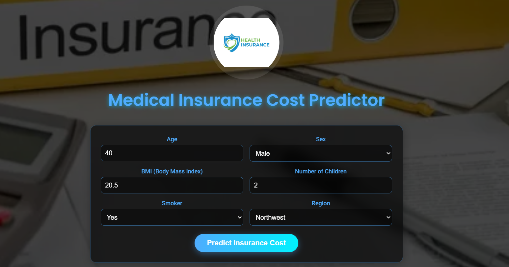

# 🏥 Medical Insurance Cost Predictor

A Machine Learning web application that predicts medical insurance costs based on user inputs like age, BMI, smoking status, and more. Built using multiple ML algorithms and deployed with Flask.

---

## 🚀 Project Overview

This project allows users to estimate their medical insurance charges by entering basic personal and health-related details through a simple web interface.

Different regression models such as Linear Regression, Support Vector Regression (SVR), Random Forest, and Gradient Boosting were trained and tested. Among them, **Gradient Boosting performed the best in terms of accuracy and error**, so it was selected as the final model for prediction and deployed in the application.

---

## 📊 Features

- Predict insurance cost instantly
- Clean and user-friendly UI
- Takes multiple inputs:
  - Age
  - Sex
  - BMI (Body Mass Index)
  - Number of children
  - Smoker status
  - Region
- Displays real-time prediction result

---

## 🛠️ Tech Stack

- Python
- Pandas, NumPy
- Scikit-learn
- Flask
- HTML, CSS

---

## 📸 Application Screenshots

### 🔹 Input Form

### 🔹 Filled Form Example

### 🔹 Prediction Result

